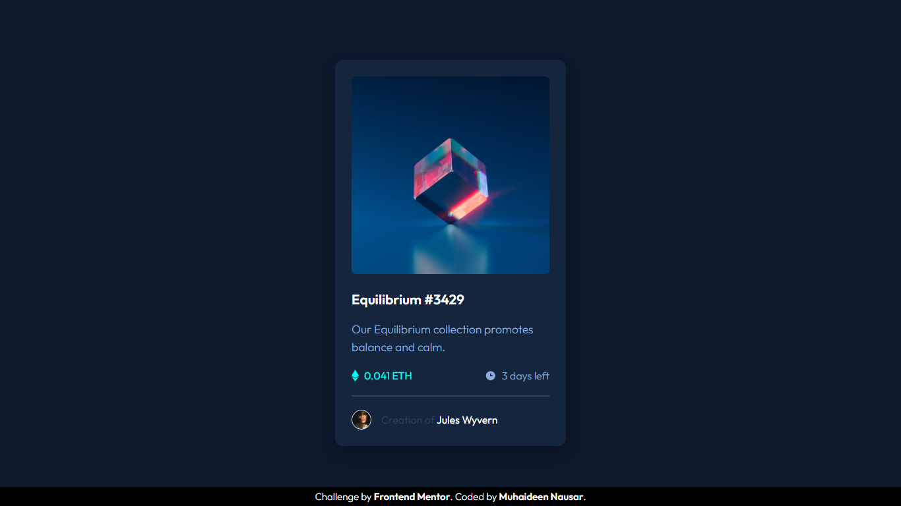

# NFT Preview Card Component Challenge

This repository contains my solution for the "NFT Preview Card Component" challenge on **Frontend Mentor**.

## Challenge Description

The "NFT Preview Card Component" challenge is a frontend development challenge aimed at improving your HTML and CSS skills. The goal of the challenge is to create a responsive NFT (Non-Fungible Token) preview card component for desktop devices.

## Challenge Details

* Challenge Difficulty: **Intermediate**
* Project Type: **HTML & CSS**
* Platform: **Frontend Mentor**
* Challenge Link: [**NFT Preview Card Component Challenge**](https://www.frontendmentor.io/challenges/nft-preview-card-component-SbdUL_w0U/hub)

## Screenshots

## My Approach

In this challenge, I focused on creating a pixel-perfect NFT preview card for desktop devices. Here are some key aspects of my approach:

* **HTML Structure**: I carefully structured the HTML to represent the content of the NFT card, including the image, title, artist name.

* **CSS Styling**: I used CSS to style the card, ensuring that it matched the provided design as closely as possible. This included setting fonts, colors, spacing, and positioning elements.

* **Responsive Design**: Although I did for the desktop version only, I made sure that my solution was well-structured and could be easily adapted for responsiveness in the future.

## Technologies Used

* **HTML**
* **CSS**

## Live Demo

You can also check out a live demo of my solution by clicking [**here**]()

## Future Improvements

While this challenge focused on the desktop version, there are several opportunities for improvement and expansion:

* **Responsive Design**: Extend the solution to be responsive for various screen sizes, including tablets and mobile devices.

* **Interactive Features**: Add interactive elements such as hover effects, tooltips, or links to enhance the user experience.

* **Accessibility**: Ensure that the NFT card meets accessibility standards for a wider audience.

* **Dynamic Content**: Connect the card to real data sources or APIs to display dynamic NFT information.

## Acknowledgments

I would like to thank Frontend Mentor for providing this challenging project, which allowed me to improve my frontend development skills.

Happy Coding!❤️